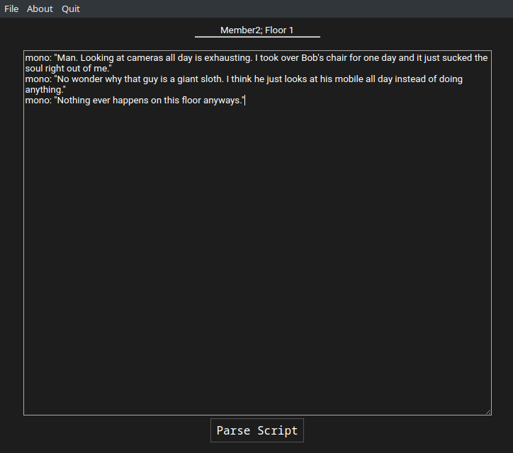

# Ren'Dot




**NOTE: This is my own custom version of the parser meant for use within my own games. It contains support for monologues and custom character expressions. However, these changes have to be accompanied by changes to the Godot Dialogue System addon itself so I have made the 'general' branch the parser for default use. Note that it still uses the old Python parser.**

A parser that takes in a Ren'Py-like text script and parse it into a JSON file for importing into radmatt's [Godot Dialogue System](https://radmatt.itch.io/godot-dialogue-system).

## Installation

Download the latest Ren'Dot version suitable for your operating system [here](https://github.com/tghgg/RenDot/releases).

## Usage

As the Windows binary is unsigned, you'll get the Windows Defender warning when starting Ren'Dot, ignore it by clicking on More info then press Run anyway. You're welcomed to not trust the binary.

On your first start, Ren'Dot will ask you for a directory to place produced JSON dialogues.

Write your script in the Ren'Dot editor. When you're done, hit the 'Parse Script' button and the output JSON dialogue will appear in the folder you chose when you first started Ren'Dot. Your script will also be auto-saved so parse often!

**Pending update**: Categorize scripts automatically by specifying a folder name behind a semicolon in the script's name, eg. 'Script Name; Folder Name'.

### Script Structure

TODO: Write proper documentation for how to write scripts for Ren'Dot.
```
// You can explain things or write notes with by using '//' to comment
Player, neutral: "Hello there, this is a dialogue."
Player, neutral: "How about we have a 3-second moment of silence?"
wait: 3
Player, neutral: "Let's log something to the console!"
// Execute GDScript inside the Godot Engine
execute: print('Hello world!')
Player, happy: "How about that!"
// 3 basic character expressions currently: Neutral, Happy, Sad; more can be added
Player, sad: "I can only make 3 faces unfornately..."
// Monologue which means there are no face sprite in the dialogue box
mono: It's okay though. When I'm in my head, the possibilities are endless!
// We can add a new character quite easily
New-Character, neutral: "Hi! I'm new here!"
```

## License
Licensed under the MIT license.
